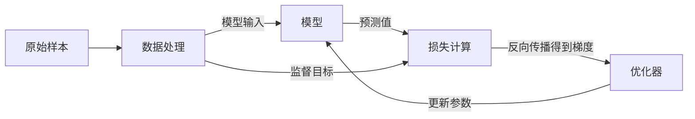
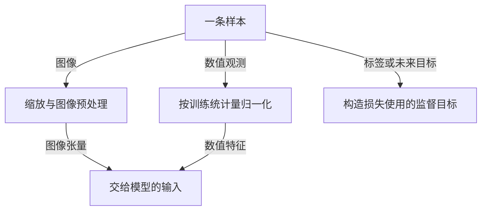

# 写法示例：具体、自然，有主次

以下例子说明表达方式，不代表所有项目都使用这些算法或文件。写导读前仍须核对目标源码，不把示例参数和路径原样套进去。

## 代码树：覆盖架构，再标出重点

假设一个项目确实包含以下文件，可以这样写：

```text
project/
├─ README.md                 安装、运行与数据准备说明
├─ pyproject.toml            依赖和包配置
├─ train.py                  ★【重要】组装数据、模型和优化器，执行训练
├─ evaluate.py               ★【重要】加载权重，计算评测指标
├─ models/
│  ├─ policy.py              ★【重要】根据观测预测动作
│  └─ encoder.py             把图像转成模型可处理的特征
├─ data/
│  ├─ dataset.py             ★【重要】读取样本，生成输入和监督目标
│  └─ transforms.py          图像和数值预处理
├─ configs/                  各任务的训练配置，同类 YAML 合并说明
├─ assets/                   图片、场景等资源，不逐项展开
├─ scripts/                  数据准备与批量实验脚本
└─ tests/                    检查数据处理、模型输出和指标计算
```

完整架构不等于列出每张图片和每份配置。核心源码说明到文件；重复变体和资源按组说明。重要文件统一使用 `★【重要】`，不是只打星，也不是只写“重要”。

## 概念：给公式、变量和理由

“归一化可以稳定训练”还不足以帮助读者看懂实现。若目标代码使用均值和标准差归一化，可以这样解释：

### 归一化：让不同量的数值范围更接近

关节位置和速度的数值范围可能差很多。下面的换算将每一维减去自己的均值，再除以标准差：

```text
x_norm = (x - mean) / std
x = x_norm * std + mean
```

`mean` 和 `std` 与要处理的特征维度对应，不一定各是一个数。例如某维的 `mean=10`、`std=2`，输入 14 归一化后是 2，表示它比均值高两个标准差。反归一化再得到原来的 14。

导读还应指向实际负责统计和换算的函数，说明统计来自哪些数据、如何保存、推理如何加载。如果代码对接近零的标准差做截断，也要解释这一项；不能把项目没有实现的保护措施说成已有功能。

这类概念要能回答“代码里的减法和除法分别在做什么”，而不只是告诉读者它叫 normalization。

## 图：总图建立关系，局部图解释内部数据

下面是假设某项目从数据训练预测模型的例子。先看整体，不在总图里塞入全部张量和辅助函数：



如果“数据处理”内部是理解算法的难点，就补一张明确对应它的局部图：



图后解释实际变量、形状、统计量来源及源码位置。还有模型内部、推理或反馈方面的难点时，再补对应的局部图，不为凑图数重复总图。独立入口分开画；只有代码中确实存在的数据传递才能连线。

判断图是否好读，不只看节点少不少：读者能否先说清整体，再选择一张局部图追细节，才是分层画图的目的。

## 注释：先告诉读者这段负责什么，再讲计算

文件顶部可以写：

```python
# 将相机深度图转换成三维点，供物体定位使用。
# 先读 depth_to_points；相机坐标到机器人坐标的转换由调用方完成。
```

核心函数开头先说明输入输出和主要过程；下面是写法示例，不是要求向目标项目新增这个函数：

```python
def td_error(reward, gamma, next_value, value):
    # 根据这一步奖励和下一状态的价值估计，检查当前价值是否低估或高估。
    # 此简化示例只处理非终止转移，返回的误差供后续更新使用。
    # gamma 用来折扣后续回报；加上当前奖励后，得到新的回报估计。
    # 再减去旧估计 value：结果为正，表示这一步比原先预期更好。
    return reward + gamma * next_value - value
```

实际实现若有终止掩码、批次维度或梯度截断，继续解释相应计算。不只写“计算 TD 误差”，也不逐字翻译加减乘号。

注释长度按核心块检查：原来 80 行，注释后总长度至少 100 行，不是新增 100 行注释。顶部介绍不能替代函数内部讲解，重复修改也不应反复叠加 25%。

## 语言自检：能否指出具体对象和动作

| 太空泛或拗口 | 更容易理解 |
| --- | --- |
| 将几何表征映射到执行空间 | 把相机坐标换成机器人底座坐标，作为机械臂的移动目标 |
| 完成状态闭环 | 把本轮执行日志交回模型，让模型决定下一步 |
| 检查输出契约 | 检查返回数组的形状、单位，以及调用方怎样使用它 |
| 进行多模态融合 | 说清实际做法，例如将图像特征与关节状态拼接后输入网络 |

右栏也只在符合实现时使用，不能把它当作统一替换词表。保留“潜变量”“逆运动学”等必要名词，并用公式或例子解释；不要用模糊的口语换掉准确概念。

读完后自问：一个懂 Python、但第一次接触这个算法的人，能否解释主要变量和计算？如果仍需靠猜测，就继续补充，而不是再加一个抽象小标题。
